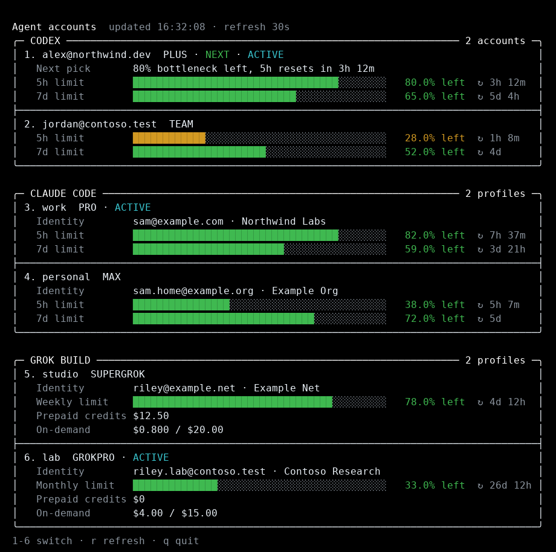
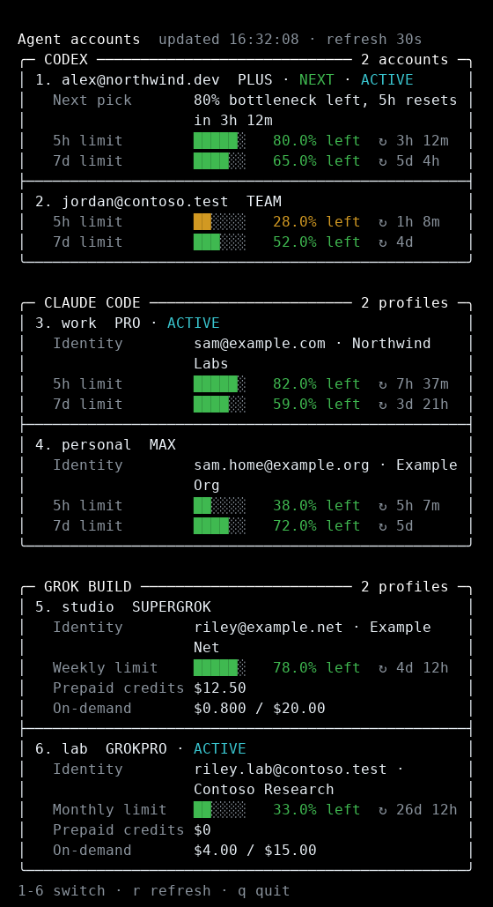

# agent-accounts

Manage multiple accounts and see usage for the three major coding-agent CLIs:

- OpenAI Codex
- Anthropic Claude Code
- xAI Grok Build

Each provider keeps its own isolated credentials. Account usage is fetched in parallel within each provider, and switching does not sign other stored accounts out. You can store as many Codex, Claude Code, and Grok Build accounts as you want.



The screenshot is a fictional demo (made-up emails and usage), not a live account dump.

## Install

```bash
npm install -g agent-accounts
```

This installs both `aa` and `agent-accounts`. Node.js 18+ is required, along with the provider CLIs you intend to use.

If your npm global bin directory is not on `PATH` (including the Raspberry Pi setup used to test this project), install into `~/.local`, which is already on `PATH`:

```bash
npm install -g --prefix "$HOME/.local" agent-accounts
```

The same CLI is also available from source:

```bash
npm install -g github:tmrk/agent-accounts
```

## Quick start

```bash
aa                                # live dashboard in a TTY (snapshot if piped)
aa --once                         # one-shot snapshot even in a TTY
aa --interval 10                  # live dashboard, refresh every 10s
aa status --live                  # same dashboard (explicit --live)

aa codex add --device-auth        # add a Codex account
aa claude add                     # add a Claude Code account
aa grok add --device-auth         # add a Grok Build account

aa codex                          # usage + interactive Codex switcher
aa claude                         # usage + interactive Claude switcher
aa grok                           # usage + interactive Grok switcher
```

The original flat Codex commands remain aliases, so `aa add`, `aa switch`, and `aa usage` work too.

The status view is a responsive terminal dashboard: each provider gets a compact section, account
state and plan are grouped in the header, and quota bars represent the percentage remaining. The
layout adapts from narrow SSH sessions to wide terminals without dropping long identities, errors,
or recommendation details. Color is used in interactive terminals and omitted automatically when
output is redirected; set `NO_COLOR=1` to disable it explicitly.

In a TTY, `aa` itself is that dashboard: it fetches in the background, paints the new frame in
place, and reflows immediately when the terminal is resized. Use `aa --once` (or pipe the
output) for a one-shot snapshot. `--live` on a single provider still works, for example
`aa codex --live`. Number keys select an account (type `12` then Enter if there are more than
nine). Selecting the account that is already active — including the only account on a
provider — is a no-op. Press `r` to refresh now, or `q` / Esc / Ctrl-C to quit. API-key spend
remains backed by its slower billing cache.

A narrower terminal reflows the same data:



## Codex

```bash
aa codex add [--device-auth]      # isolated OAuth login
aa codex add-key                  # API-key account
aa codex import                   # import ~/.codex/auth.json
aa codex list
aa codex switch [email]
aa codex gui-switch [email]       # switch and restart Codex.app on macOS
aa codex remove <email>
aa codex usage [days]             # API spend via an attached admin key
```

Codex OAuth profiles show the rolling five-hour and weekly limits, extra applicable buckets, plan, and credit balance. API-key accounts can show daily, weekly, and monthly spend when an OpenAI admin key and project are attached.

## Claude Code

```bash
aa claude add [name]
aa claude list
aa claude switch [name]
aa claude run [name] [...args]
aa claude remove <name>
aa claude env
```

Claude profiles use separate `CLAUDE_CONFIG_DIR` directories and show five-hour, weekly, model-specific, and extra-usage limits when available.

To make the selected profile active for direct `claude` invocations:

```bash
eval "$(aa claude env)"
```

Add that line to `.zshrc` or `.bashrc` if you want `aa claude switch` to control future shells automatically. `aa claude run <name>` needs no shell integration.

## Grok Build

```bash
aa grok add [name] [--device-auth]
aa grok list
aa grok switch [name]
aa grok run [name] [...args]
aa grok remove <name>
aa grok env
```

Grok profiles use separate `GROK_HOME` directories. They show the weekly or monthly included-credit pool, reset time, prepaid credits, on-demand usage, and subscription tier—the same account-wide data used by Grok Build's `/usage` view.

To make the selected profile active for direct `grok` invocations:

```bash
eval "$(aa grok env)"
```

Grok Build officially supports `GROK_HOME`, browser OAuth, and `grok login --device-auth`; see the [Grok Build authentication guide](https://docs.x.ai/build/authentication) and [settings reference](https://docs.x.ai/build/settings).

## Storage and migration

agent-accounts stores profile metadata and isolated provider homes under `~/.agent-accounts/`, with credential files written owner-only by this app or the provider CLI. Codex still activates an account through its standard `~/.codex/auth.json` file.

On first run, if `~/.agent-accounts/` does not exist but `~/.codex-accounts/` does, the old store is copied to the new location. The old directory is left intact, so the existing `codex-accounts` installation and its PR workflow are unaffected.

Usage integrations for subscription accounts call the same provider endpoints their CLIs use. Those endpoints are not stable public billing APIs and may change when a provider updates its CLI.

## Development

```bash
npm install
npm test
npm start -- help
npm run screenshots   # regenerate the fictional README images
```

## License

MIT
